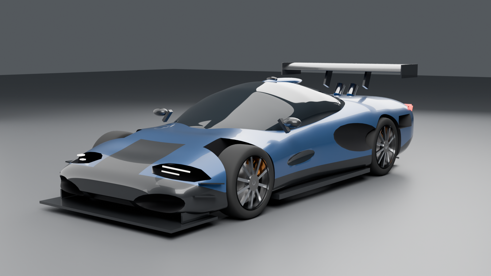
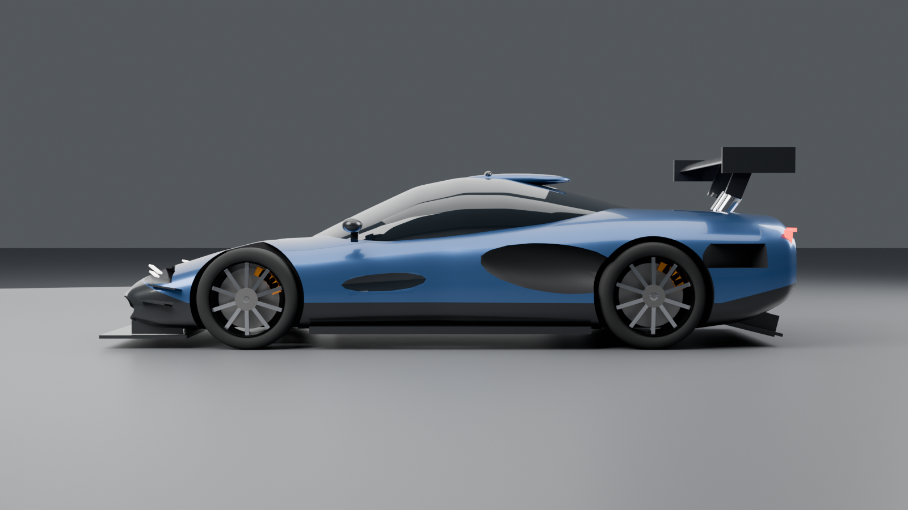
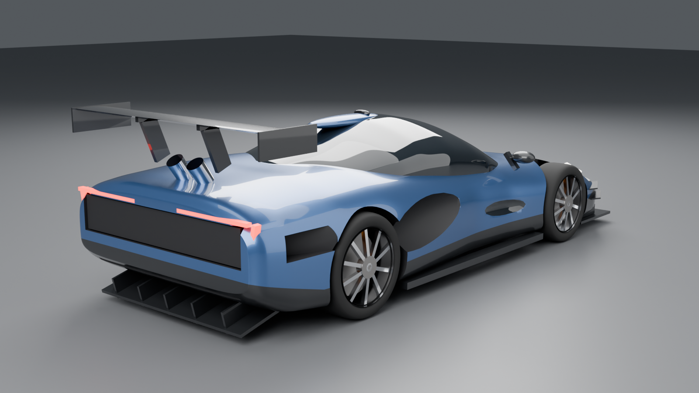

# Supercar (McLaren-style)

A papaya-orange, McLaren-inspired supercar generated entirely by a Blender Python
script. No badges or logos: it is an original design in that style.



| | |
|---|---|
|  |  |

## Files

| File | Use |
|---|---|
| `build_supercar.py` | The generator. Change the numbers at the top (colour, length, wheel sizes) and re-run. |
| `out/supercar_roblox.fbx` | Import into Roblox Studio (3D Importer). Every part is under the 20k-triangle MeshPart limit. |
| `out/supercar.glb` | Full-detail model for web viewers, Blender, Unity, Godot. |
| `out/supercar.blend` | Open in Blender to keep editing by hand. |
| `out/render_*.png` | Preview renders. |

## Parts

Each part is a separate object, so you can recolour or script them on their own:

- `Body`, `Cabin` (glass), `Mirrors`, `Headlights`, `Taillights`
- `Splitter`, `SideSkirts`, `Diffuser`, `RearWing`, `WingSupports`, `RearGrille`, `Exhausts`
- `Wheel_FL`, `Wheel_FR`, `Wheel_RL`, `Wheel_RR`: tyre, rim and brake disc, with the
  origin at the hub so they can spin (in Roblox, attach them with `HingeConstraint`s)
- `Calipers`: these stay fixed and don't spin with the wheels

## Roblox notes

- In the 3D Importer, check the scale: the car is 4.55 m long, which is about 16 studs.
  Adjust the import scale if it comes in at the wrong size.
- The car's front faces -Y in Blender. Rotate it after import if it faces the wrong way.
- Glass is a dark glossy material (no transparency) so it looks the same in Roblox.

## Regenerate

```bash
pip install bpy            # Blender as a Python module, needs Python 3.11
python build_supercar.py out             # full build + 4 renders (~8 min on 4 CPU cores)
python build_supercar.py out --preview   # quick 2-view preview
python build_supercar.py out --no-render # just the model files
```
